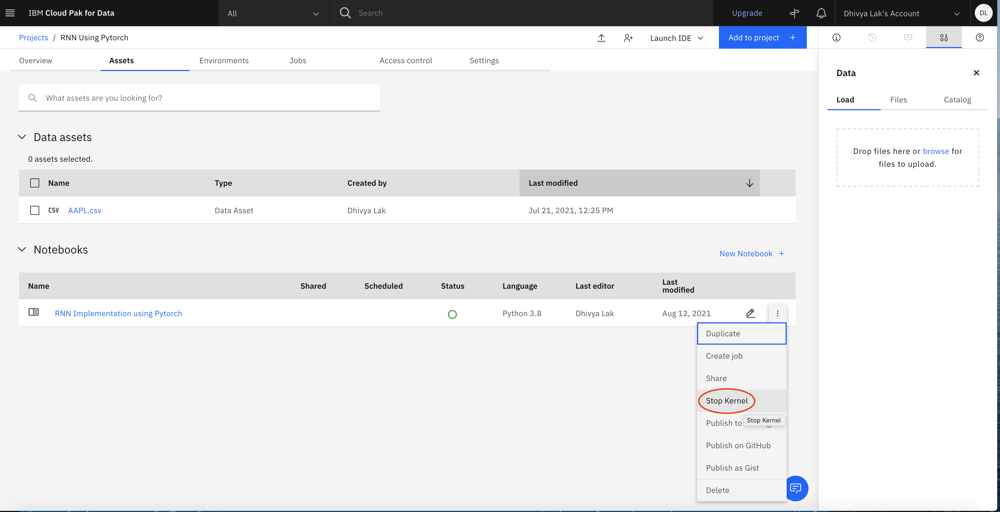
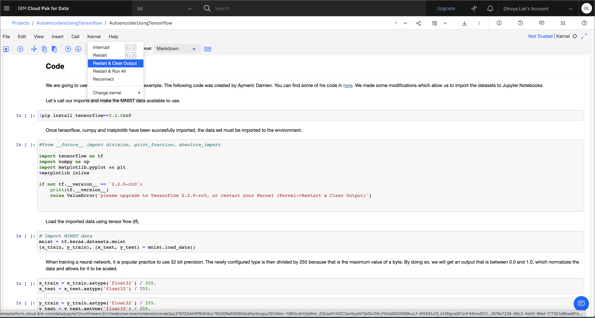

# RNNPytorch
 
[Deep Learning](https://developer.ibm.com/learningpaths/get-started-with-deep-learning/an-introduction-to-deep-learning/) is vast field that employs artifical neural networks to process data and train a machine learning model. Two approaches used are *[supervised and unsupervised learning](https://developer.ibm.com/learningpaths/get-started-with-deep-learning/deep-learning-architectures/)*. In this tutorial, we will be focusing on Recurrent Neural Networks. An RNN utilizes supervised Deep Learning to employ sequential learning to develop a model. This Deep Learning technique is especially useful when handling time series data- as we are doing in this tutorial. 

As with creating any machine learning model, it is important we understand the data we are analyzing. This allows the developer to utilize the most relevant model architecture. Specifically, the aim of this tutorial is to create a basic model that can predict the value of a given stock using daily Open, High, Low and Close Values. The stock market can be extremely volatile and there are many factors that can influence and contribute to the value of a stock. Let us start by better understanding the different parameters of the stock data. 

* **Open**: The price of a given stock when the market opens. 

* **High**: The highest price a stock is trading at during market hours. 

* **Low**: The lowest price a stock is tradign at duruing market hours. 

* **Close**: The price of a given stock when the market closes. It is used by financial institutions as the value of a stock on a particular day as its takes in to account all of the events of the day and any fluctuations that could have occured during the market. 

The overall importance of the close value, and its use as a benchmark for the daily value of a stock, indicates that this is the value we should try and predict. In order to accomplish this, we can build a model that leverages Long Short Term Memory, an RNN technique, to store concurrently analyze larger sets of time series data. 

In this tutorial, a Stock Data collected by IBM Watson is imported and deployed on IBM Watson Studio on IBM Cloud Pak® for Data.

# Learning Objectives

In the tutorial, you import a Jupyter Notebook that is written in Python into IBM Watson Studio on IBM Cloud Pak for Data as a Service, then run through the Notebook. The Notebook creates an Autoencoder model using Tensorflow based on an MNIST data set, encoding and decoding the data. After running the Notebook, you should understand how TensorFlow builds and executes an Autoencoder. You'll learn how to:

- Run a Jupyter Notebook using Watson Studio on IBM Cloud Pak for Data as a Service
- Build an Autoencoder model using Tensorflow
- Train the model and evaluate the model by performing validation and testing

# Prerequisites

The following prerequisites are required to follow the tutorial:

- An IBM Cloud account
- IBM Cloud Pak for Data

# Estimated time
It should take you approximately **x** hours complete the tutorial.

# Steps 

1. Set up IBM Cloud Pak for Data as a Service.
2. Create a new project and import the Notebook.
3. Import Stock Data CSV file to your newly imported Notebook
    a. Open data set in IBM Cloud Pak
    b. Examine data
    c. Follow import instructions. 
><strong>DO NOT SHARE THE NOTEBOOK WITH THE NEWLY IMPORTED DATA! Each import contains a personailized and secure API key. DO NOT publish the notebook with the API key to any public Version Control systems (i.e. GitHub). This WILL compromise the security of your account</strong>. 
4. Read through the Notebook.
5. Run the Notebook.

# Set up IBM Cloud Pak for Data as a Service.

1.Open a browser, and log in to IBM Cloud with your IBM Cloud credentials.

2.Type Watson Studio in the search bar at the top. If you already have an instance of Watson Studio, it should be visible. If so, click it. If not, click Watson Studio under Catalog Results to create a new service instance.

3.Select the type of plan to create if you are creating a new service instance. A Lite (free) plan should suffice for this tutorial. Click Create.

4.Click Get Started on the landing page for the service instance.

This takes you to the landing page for IBM Cloud Pak for Data as a Service.

5.Click your avatar in the upper right, then click Profile and settings under your name.

6.Switch to the Services tab. You should see the Watson Studio service instance listed under your Your Cloud Pak for Data services.

You can also associate other services such as Watson Knowledge Catalog and Watson Machine Learning with your IBM Cloud Pak for Data as a Service account. These are listed under Try our available services.

In the example shown here, a Watson Knowledge Catalog service instance exists in the IBM Cloud account, so it's automatically associated with the IBM Cloud Pak for Data as a Service account. To add any other service (Watson Machine Learning in this example), click Add within the tile for the service under Try our available services.

7. Select the type of plan to create (a Lite plan should suffice), and click Create.

After the service instance is created, you are returned to the IBM Cloud Pak for Data as a Service instance. You should see that the service is now associated with Your IBM Cloud Pak for Data as a Service account.

# Create a new project and import the Notebook

1. Navigate to the menu (☰) on the left, and choose View all projects. After the screen loads, click New + or New project + to create a new project.

2. Select Create an empty project.

3. Provide a name for the project. You must associate an IBM Cloud Object Storage instance with your project. If you already have an IBM Cloud Object Storage service instance in your IBM Cloud account, it should automatically be populated here. Otherwise, click Add.

4. Select the type of plan to create (a Lite plan should suffice for this tutorial), and click Create.

5. Click Refresh on the project creation page.

6. Click Create after you see the IBM Cloud Object Storage instance that you created displayed under Storage.

7. After the project is created, you can add the Notebook to the project. Click Add to project +, and select Notebook.

8. Switch to the From URL tab. Provide the name of the Notebook as "RNN Implementation using Pytorch". Notebook URL as: "update"

9. Under the Select runtime drop-down menu, select Default Python 3.7 S (4 vCPU 16 GB RAM). Click Create.

10. After the Jupyter Notebook is loaded and the kernel is ready, you can start running the cells in the Notebook.

    Important: Make sure that you stop the kernel of your notebooks when you are done to conserve memory resources.

    Note: The Jupyter Notebook included in the project has been cleared of output. If you would like to see the Notebook that has already been completed with output, refer to the [example Notebook](https://raw.githubusercontent.com/IBM/dl-learning-path-assets/main/unsupervised-deeplearning/examples/autoencoders.ipynb).
# Import Stock Data CSV file
For this tutorial, we will be using Stock Data from IBM Watson. You can find the link to the stock data here:

1. Go to your "RNN Implementation using Pytorch" project. 

2. 

# Read through the Notebook

Spend some time looking through the sections of the Notebook to get an overview. A Notebook is composed of text (markdown or heading) cells and code cells. The markdown cells provide comments on what the code is designed to do.

You run cells individually by highlighting each cell, then either clicking Run at the top of the Notebook or using the keyboard shortcut to run the cell (Shift + Enter, but this can vary based on the platform). While the cell is running, an asterisk ([*]) appears to the left of the cell. When that cell has finished running, a sequential number appears (for example, [17]).

    Note: Some of the comments in the Notebook are directions for you to modify specific sections of the code. Perform any changes as indicated before running the cell.

The Notebook is divided into multiple sections:

Section 6 contains the code to create, validate, test, and run the autoencoder model.

# Run the Notebook

1. Run the code cells in the Notebook starting with the ones in section 4. The first few cells bring in the required modules such as TensorFlow, Numpy, reader, and the data set.

    Note: The second code cell checks for the version of TensorFlow. The Notebook works only with TensorFlow version 2.2.0-rc0. Therefore, if an error is thrown here, you need to ensure that you have installed TensorFlow version 2.2.0-rc0 in the first code cell.

    Note: If you have installed TensorFlow version 2.2.0-rc0 and still get the error, your changes are not being picked up and you must restart the kernel by clicking Kernel->Restart and Clear Output. Wait until all of the outputs disappear, and then your changes should be picked up.

2. The training, validation, and testing of the model does not happen until the last code cell. Running all 20 epochs will take some time, about 30 minutes at most.

# Summary

In this tutorial, you learned about Autoencoders and ran an implementation on Jupyter Notebook using Watson Studio on IBM Cloud Pak for Data as a Service. Utilizing python libraries such as: Tensorflow, MatPlotLib, and NumPy were also key to create the model.
